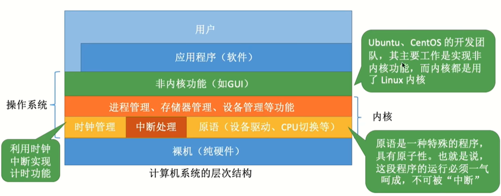
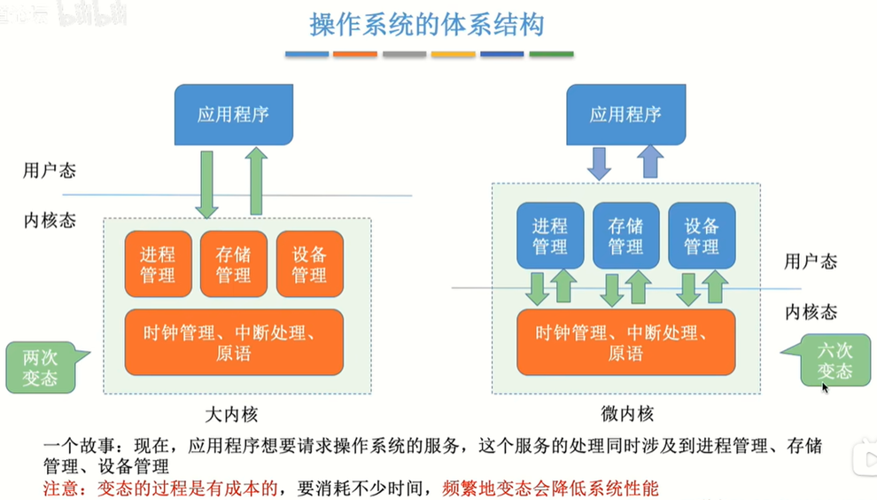
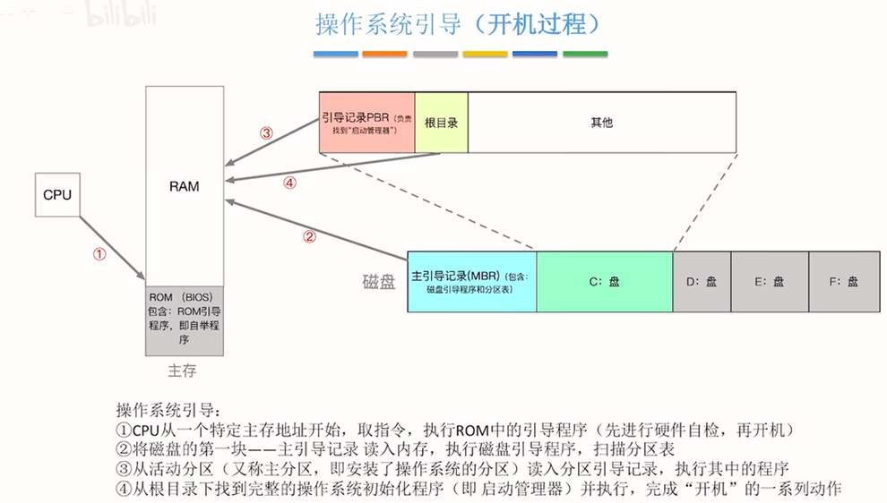

# 一、概论
## 1. 操作系统的概念与功能
|用户|
|-|
|**用用程序(软件)**|
|**操作系统**|
|**逻辑(纯硬件)**|

概念：
- 操作系统是系统资源的管理者
  - 文件管理
  - 存储器管理
  - cpu管理
  - 设备管理
- 操作系统是最接近硬件的一层软件
- 操作系统向上层提供方便易用的服
  - 命令接口（直接给用户使用）
    - 联机命令接口/交互式命令接口
    - 脱机命令接口/批处理命令接口
  - 程序接口（给软件/程序员使用）

## 2. 操作系统的四个特征
```mermaid
graph LR
    A["操作系统的四个特征"]-->AB1["并发"]
    A-->AB2["共享"]
    A-->AB3["虚拟"]
    A-->AB4["异步"]
```

### 2.1 并发
- 概念：一段时间多个程序交替执行，即每个程序都运行一小段时间，然后换下一个程序继续运行。因为每个程序的暂停间隔很小，所以看起来就像多个程序同时运行
  > 并行：多个程序同时运行
  > 
  > 并发：多个程序交替执行，由于交替时间短宏观上是在同时执行

- 注意：
  - 单核CPU同一时刻只能执行一个程序，各个程序只能并发地执行
  - 多核CPU同一时刻可以同时执行多个程序，多个程序可以并行地执行
### 2.2 共享
- 互斥共享方式：一个时间段内只允许一个进程访问系统某些资源
- 同时共享方式：一个时间段内允许多个进程访问系统某些资源
### 2.3 虚拟
- 概念：把一个物理上的实体转变为若干个逻辑上的对应物

虚拟：
- 空分复用技术
- 时分复用技术

### 2.4 异步
- 概念：并发的进程存在执行顺序不确定，执行时间不确定，执行结果不确定等众多不确定因素导致它们以不可预知的速度向前推进

## 3. 操作系统的运行机制
- 两类程序：
  - 内核程序：即操作系统内核的程序，是操作系统最核心的部分
  - 应用程序：普通程序员写的程序
- 两类指令：
  - 特权指令：内核程序可以使用的指令，因为这些指令涉及对硬件的操作，只能由操作系统内核直接使用
  - 非特权指令：应用程序可以使用的对cpu来说是合法的指令
- 两种处理其状态：
  - 内核态：处于内核态时，说明此时正在运行的是内核程序，可以执行特权指令
  - 用户态：处于用户态时，说明此时正在运行的是应用程序，可以执行非特权指令
- CPU状态切换：
  - 内核态-->用户态：CPU执行一条特权指令（修改PSW的标志位为“用户态”），这一意味着操作系统主动让出CPU操作权
  - 用户态-->内核态：由中断引发，出发中断意味着操作系统将强行夺回CPU的使用权

## 4. 中断和异常
- 中断：
  - 内中断（也称"异常"）：与当前执行的指令有关，中断信号来源于CPU内部
    > 陷入指令：当应用程序向请求操作系统内核的服务，会执行陷入指令，引发一个内部中断信号，并意味着应用程序主动将CPU控制权归还给操作系统内核
    - 陷入：应用程序为了进行系统调用故意使用陷入指令来引发异常
    - 故障：错误条件导致的异常，可能被内核程序修复
    - 终止：致命错误导致的异常，内核程序无法修复
  - 外中断（也称"中断"）：与当前执行的指令无关，中断信号来源于CPU外部
    - 时钟中断
    - I/O中断请求

## 5. 系统调用
- 系统调用概念：一种可供应用程序调用的一系列特殊函数。应用程序通过系统调用可以获得操作系统内核的服务
- 系统调用分类：
  - 设备管理：完成设备的请求／释放／启动 等功能
  - 文件管理：完成文件的读／写／创建／删除 等功能
  - 进程控制：完成进程的创建／撤销／阻塞／唤醒 等功能
  - 进程通信：完成进程之间的消息传递／信号传递 等功能
  - 内存管理：完成内存的分配／回收 等功能
- 系统调用的过程：传参->陷入指令->由操作系统内核程序处理系统调用请求->返回应用程序

## 6. 操作系统体系结构

操作系统内核：
- 时钟管理
- 中断处理
- 原语
  > 原语是一种特殊的程序，这种程序的运行不能被中断
- 对系统资源进行管理的功能
  - 进程管理
  - 存储器管理
  - 设备管理

大内核和微内核：

- 典型的大内核：Linux
- 典型的微内核：Windows NT

## 10. 操作系统引导

操作系统引导：
- CPU从一个特定主存地址开始，取指令，执行ROM中的引导程序（先进行硬件自检，再开机）
- 将磁盘的第一块——主引导记录读入内存，执行磁盘引导程序，扫描分区表
- 从活动分区（又称主分区，即安装了操作系统的分区）读入分区引导记录，执行其中的程序
- 从根目录下找到完整的操作系统初始化程序（即启动管理器）并执行，完成“开机”的一系列动作